==== Работа в IAR Embedded Workbench

После создания проекта нужно было подключить файл _cstartup_. Чтобы его подключить,
используем _Add - Add Files..._

.Добавление файла cstartup.cpp
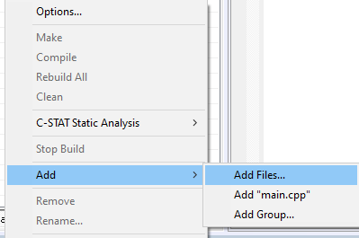

Теперь нам нужно настроить сам проект, его структуру. Для этого
аналогично, через меню _Add - Add Group..._ добавим необходимые
папки _AHardware/Registers/STM32F411, Common, Application_.

.Структура проекта
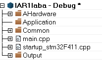

Теперь добавим все нужные заголовочные файлы. Для
этого будем скопируем их в корневую папку проекта (рисунок 3).

.Перенос заголовочных файлов

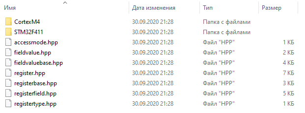

После этого мы должны добавить данные файлы в программе *IAR Embedded
Workbench*. Используем _Add-Add Files..._  (рисунок 4).

.Полученный результат
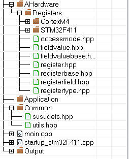

После выполнения всех действий запишем код в _main.cpp_ (рисунок 5).

.Код в программе
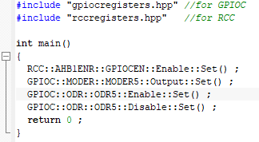

Запустим программу через отладчик "_Simulator_" (рисунок 6).

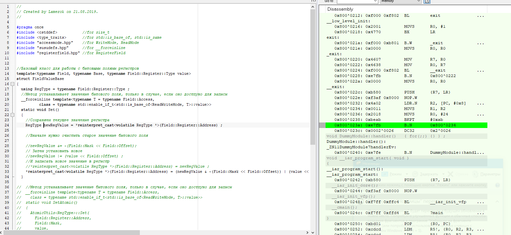

Чтобы запустить программу на микроконтроллере нам нужно сделать
первичные настройки проекта.
Изменим пункт _Device_ на микроконтроллер *STM32F411 RE* в
меню _General Options_ (рисунок 7)

.Настройка проекта
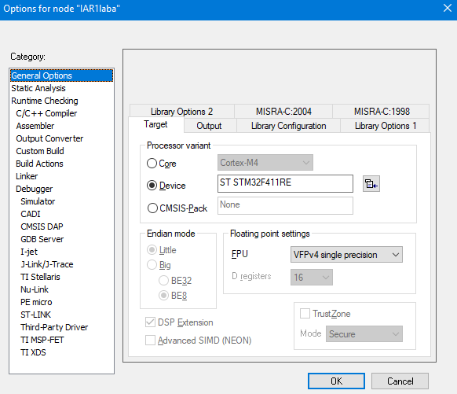

В меню _Options - Debugger_ выбираем внутрисхемный отладчик
_ST-Link_ и интерфейс SWD (рисунок 8).

.Настройка проекта
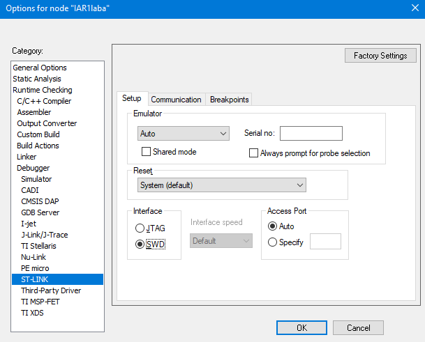

Также произведем настройку _Stack/Heap_. (рисунок 9)

.Настройка STACK/HEAP
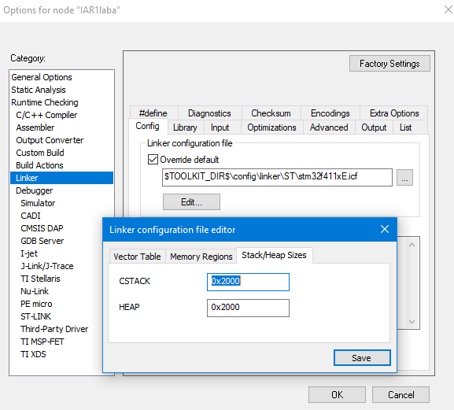

После выполнения всех этих действий, загрузим программу в плату.
Выполняем пошаговую отладку и никаких видимых изменений на плате не заметили.

=== Запуск анализатора стека

Чтобы его включить, нужно перейти в _Options - Linker - Advanced..._ и
поставить галочку напротив _Enable stack usage analysis_ (рисунок 10).

.Запуск анализатора стека
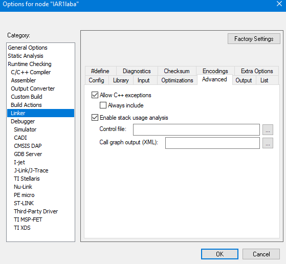

Откроем файл с расширением _.map_ и заметим, что в данном случае анализ
стека показывает, что размер
стека при максимальной цепочке вложенности может быть 16 байт

.Открытие _.map_ файла
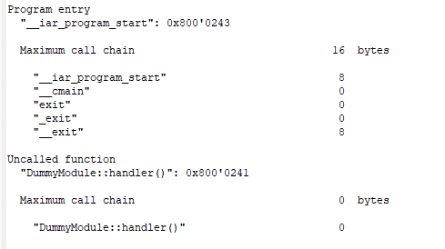

=== Установка размеров стека и "кучи" в ноль

.Установка Stack/Heap в ноль
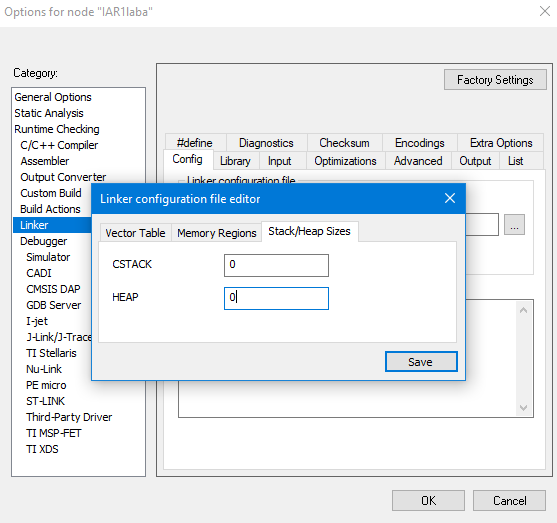

В данном случае мы не работаем с динамически создаваемыми объектами, поэтому
*Heap* можно поставить в 0.

А вот *Stack* нельзя, потому что происходит вызов пустых функций и компилятор не
может вставить функцию прямо из код.

=== Ответы на вопросы:

1) _Интегрированная среда разработки_ - комплекс программных средств, используемый программистами для разработки программного обеспечения._

2) _**Транслятор** - программа, переводящая исходный код (программу, написанную на одном из высокоуровневых языков программирования) в объектный код, используемый процессором компьютера, или в промежуточный код для последующей интерпретации. Помимо осуществления перевода, трансляторы могут выявлять в исходном коде ошибки, оптимизировать исходный код, добавлять в исходный код отладочные процедуры, формировать словари идентификаторов и другое._

_**Компилятор** – это вариант реализации транслятора, который создаётся для перевода программы, написанной на высокоуровневом языке программирования в машинный код, который в последствие будет исполняться процессором
Компилятор является видом транслятора и предназначен только для
перевода кода. Осуществлять выявление ошибок в коде, оптимизац
ию, добавлять в исходный код отладочные процедуры и др он не способен._

3) _**Компоновщик** предназначен для связывания между собой объектных файлов, порождаемых компилятором, а также файлов библиотек, входящих в состав системы программирования.
Объектный файл (или набор объектных файлов) не может быть исполнен до тех пор, пока все модули и секции не будут в нем увязаны между собой. Это и делает редактор связей (компоновщик)._

Компоновщик:

- комбинирует (компонует, редактирует) различные объектные файлы;
- устанавливает связи между объявлением функции или переменной с ее определением._

4) Проектирование программного обеспечения — процесс создания проекта программного обеспечения (ПО), а также дисциплина, изучающая методы проектирования. Проектирование ПО является частным случаем проектирования продуктов и процессов.

Основные задачи, входящие в процесс проектирования ПО:

- выбор метода и стратегии решения;

- выбор представления внутренних данных;

- разработка основного алгоритма;

- документирование ПО;

- тестирование и подбор тестов;

- выбор представления входных данных.

5) Получение требования на проект - Анализ - Degish - Develop - Debug - Тестрирование ПО -
Использование

6) Отладка нужна для того, чтобы понять на каком этапе
программирования произошла ошибка, так как можно запустить
программу до точки отладки, а не всю целиком.

7) Какие еще важные IAR workbench можно добавить в таблицу [Характеристики IAR]

- Совместимость с большим количеством микроконтроллеров;
- Мониторинг состояние процессора;

- Большая база пользователей и документации.
- Удобная отладка с возможностью просматривать состояние переменных;

